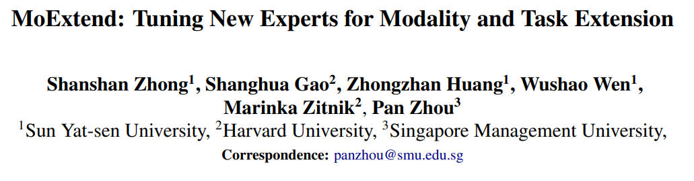

# MoExtend

[](https://www.arxiv.org/pdf/2408.03511)
</br>


<p align="center">
   
</p>


This repository is the official codebase of "MoExtend: Tuning New Experts for Modality and Task Extension" [[paper]](https://www.arxiv.org/pdf/2408.03511). Our paper has been accepted at the ACL 2024 Student Research Workshop.


## Introduction

Large language models (LLMs) excel in various tasks but are primarily trained on text data, limiting their application scope. Expanding LLM capabilities to include vision-language understanding is vital, yet training them on multimodal data from scratch is challenging and costly. In this work, we introduce MoExtend, an effective framework designed to streamline the modality adaptation and extension of Mixture-of-Experts (MoE) models. MoExtend seamlessly integrates new experts into pre-trained MoE models, endowing them with novel knowledge without the need to tune pretrained models such as MoE and vision encoders. 
- This approach enables rapid adaptation and extension to new modal data or tasks, effectively addressing the challenge of accommodating new modalities within LLMs. 
- Furthermore, MoExtend avoids tuning pretrained models, thus mitigating the risk of catastrophic forgetting. 

## News 

2024/8/9 - We released our training code. Please check it out! 

2024/8/9 - We released our paper [[arxiv]](https://www.arxiv.org/pdf/2408.03511). Please check it out! 


## TODO

- [x] preprint paper
- [x] training code
- [ ] checkpoint


## Training

MoExtend can be trained on 8 A100 GPUs with 80GB memory. To train on fewer GPUs, you can reduce the per_device_train_batch_size and increase the gradient_accumulation_steps accordingly. Always keep the global batch size the same: per_device_train_batch_size x gradient_accumulation_steps x num_gpus. 

### Environment

```shell
sh env.sh
```

### Dataset

See `data_preprocess.ipynb`

### Alignment Stage

```shell
torchrun --nproc_per_node 8 --master_port=8888 finetune_deepspeed.py \
    --project_name VisionMixtralForCausalLM --model_id zhongshsh/Mixtral-Vision \
    --vision_encode --output_dir checkpoints/vision --save_steps 1000 \
    --save_total_limit 10 --deepspeed_config ds_config_zero2.json 
```

### Extension Stage

```shell
torchrun --nproc_per_node 8 --master_port=8888 finetune_deepspeed.py \
    --project_name VisionMixtralForCausalLM --model_id checkpoints/vision \
    --output_dir checkpoints/vision_gate --expert_gate --save_steps 1000 \
    --max_steps 1000 --deepspeed_config ds_config_zero2.json 
```

Then calculate the expert distribution of model.
```shell
python expert_distribution.py
```

Based on the result of `expert_distribution.py`, init the parameters of Fine-tuning Stage.
```
python init_expert.py
```

### Fine-tuning Stage

```shell
torchrun --nproc_per_node 8 --master_port=8888 finetune_deepspeed.py \
    --project_name MoExtendForCausalLM --vision_encode \
    --output_dir checkpoints/vision_gate_ft --save_steps 1000 \
    --save_total_limit 10 --deepspeed_config ds_config_zero3.json
```

### Evaluation

Our evaluation mainly follows [LLaVA Evaluation](https://github.com/haotian-liu/LLaVA/blob/main/docs/Evaluation.md).

## Citation

```
@inproceedings{pu2023chatgpt,
  title={MoExtend: Tuning New Experts for Modality and Task Extension},
  author={Zhong, Shanshan and Gao, Shanghua and Huang, Zhongzhan and Wen, Wushao and Zitnik, Marinka and Zhou, Pan},
  booktitle={Proceedings of the 62nd Annual Meeting of the Association for Computational Linguistics (Volume 4: Student Research Workshop)},
  year={2024}
}
```

## Acknowledgments

Many thanks to [mistral.ai](https://huggingface.co/mistralai) for their inspiring works, [huggingface](https://github.com/huggingface) for their well-structured [transformers](https://github.com/huggingface/transformers), and [LLaVA](https://github.com/haotian-liu/LLaVA) for their datasets.
